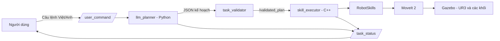

# Báo cáo dự án: Điều khiển robot UR3 bằng ngôn ngữ tự nhiên

**Sinh viên:** Nguyen Van An  
**MSSV:** 23020733  
**Bài phân công:** Student ID = 33  
**Nền tảng:** ROS 2 Humble, Gazebo, MoveIt 2, Python và C++

## 1. Mục tiêu dự án

Dự án xây dựng một hệ thống mô phỏng robot UR3/UR3e có thể nhận câu lệnh tiếng Việt hoặc tiếng Anh. Thay vì phải điều khiển từng khớp robot, người dùng chỉ cần nhập yêu cầu như:

```text
Sắp xếp tất cả khối theo student ID = 33.
```

Hệ thống sẽ dùng mô hình ngôn ngữ lớn (LLM) để hiểu câu lệnh, tạo kế hoạch thao tác an toàn, sau đó dùng MoveIt 2 điều khiển robot trong Gazebo.

Với bài phân công số 33, cách sắp xếp là:

| Vùng đích | Khối cần đặt |
| --- | --- |
| Zone A | Khối vàng (`yellow_cube`) |
| Zone B | Khối xanh dương (`blue_cube`) |
| Zone C | Khối đỏ (`red_cube`) |

## 2. Ý tưởng hoạt động

Hệ thống chia bài toán thành hai phần:

1. **LLM hiểu ý định người dùng:** chuyển câu tự nhiên thành danh sách thao tác có cấu trúc JSON.
2. **Robot thực hiện an toàn:** chỉ chấp nhận các thao tác đã được cho phép và để MoveIt 2 tự tính quỹ đạo tránh va chạm.

LLM không được gửi trực tiếp góc khớp, pose tự do hoặc quỹ đạo đến robot. Nó chỉ được phép tạo các skill trong danh sách cho phép: `pick`, `place`, `home`, `move_above`, `open_gripper`, `close_gripper` và `move_to_zone`.

## 3. Kiến trúc hệ thống



Các thành phần chính:

| Thành phần | Vai trò |
| --- | --- |
| `scripts/llm_planner.py` | Nhận câu lệnh, gọi 9Router/LLM và kiểm tra kế hoạch JSON. |
| `python/ur3_llm_control/task_validator.py` | Kiểm tra tên skill, vật thể, vùng đích và thứ tự pick/place. |
| `src/skill_executor.cpp` | Nhận kế hoạch hợp lệ và thực hiện từng skill theo thứ tự. |
| `src/robot_skills.cpp` | Cài đặt thao tác gắp, đặt, mở/kẹp gripper và điều khiển MoveIt 2. |
| `config/scene.yaml` | Lưu vị trí khối, vùng đích, pose home, vận tốc và thông số chuyển động. |
| `config/student.yaml` | Lưu thông tin sinh viên và quy tắc sắp xếp cá nhân. |

## 4. Luồng xử lý một câu lệnh

Ví dụ người dùng chạy:

```bash
ros2 run ur3_llm_control command \
  "Arrange all objects according to student ID = 33."
```

### Bước 1: Gửi câu lệnh

Chương trình `command.py` publish câu lệnh lên topic `/user_command`.

### Bước 2: LLM tạo kế hoạch

`llm_planner.py` gửi câu lệnh và prompt đến 9Router. LLM phải trả về JSON, ví dụ:

```json
{
  "plan": [
    {"skill": "pick", "object": "yellow_cube"},
    {"skill": "place", "object": "yellow_cube", "zone": "zone_a"},
    {"skill": "pick", "object": "blue_cube"},
    {"skill": "place", "object": "blue_cube", "zone": "zone_b"},
    {"skill": "pick", "object": "red_cube"},
    {"skill": "place", "object": "red_cube", "zone": "zone_c"},
    {"skill": "home"}
  ]
}
```

### Bước 3: Kiểm tra an toàn

Kế hoạch được kiểm tra hai lần: lần đầu ở Python và lần hai ở C++ trước khi robot chạy. Hệ thống từ chối kế hoạch nếu có một trong các lỗi sau:

- Skill không nằm trong danh sách cho phép.
- Tên khối hoặc vùng không hợp lệ.
- Đặt khối khác với khối đang cầm.
- Gắp khối mới khi gripper còn đang cầm khối khác.
- `home()` xuất hiện ở giữa kế hoạch nhiều vật thể.
- Kế hoạch kết thúc khi robot vẫn đang cầm một khối.

### Bước 4: Robot thực thi liên tục

Robot thực hiện lần lượt `pick` và `place` cho ba khối. Sau khi đặt một khối, robot **không về home**; nó dừng 2 giây rồi di chuyển tới khối tiếp theo. `home()` chỉ chạy một lần khi toàn bộ nhiệm vụ hoàn tất.

Mỗi thao tác `pick` gồm: mở gripper, di chuyển phía trên khối, hạ theo đường Cartesian, đóng gripper và nâng khối lên. Mỗi thao tác `place` gồm: đi phía trên vùng đích, hạ xuống, mở gripper, tách vật thể khỏi gripper và nâng lên lại.

### Bước 5: Báo trạng thái

Kết quả được hiển thị trên terminal và topic `/task_status`:

```text
RESULT: SUCCESS
```

hoặc:

```text
TASK_FAILED: PLANNING_FAILED
RESULT: FAILED
```

## 5. Tính năng nâng cao đã thực hiện

### 5.1. Một lệnh cho nhiều vật thể

Hệ thống nhận một câu lệnh duy nhất và sinh kế hoạch gồm ba cặp `pick/place`. Kế hoạch có bảy bước, trong đó `home()` luôn là bước cuối.

### 5.2. Thực thi không về home giữa chừng

Để giảm chuyển động dư thừa, robot không quay lại tư thế home sau từng khối. Cấu hình `inter_object_pause_seconds: 2.0` trong `config/scene.yaml` tạo khoảng dừng hai giây giữa các lượt để dễ quan sát mô phỏng.

### 5.3. Phân công theo mã số sinh viên

Mapping cho student ID = 33 được lưu trong `config/student.yaml` và được đưa vào prompt của LLM. Nhờ đó LLM biết khối nào phải đi đến vùng nào khi nhận lệnh sắp xếp toàn bộ vật thể.

### 5.4. An toàn khi dùng LLM

LLM chỉ tạo kế hoạch mức cao. Chương trình C++ mới là nơi gọi hàm điều khiển robot. Thiết kế này giảm nguy cơ LLM tạo lệnh chuyển động tùy ý hoặc giá trị góc khớp không hợp lệ.

## 6. Cấu hình scene

Các khối ban đầu và vùng đích nằm trên bàn làm việc trong Gazebo:

| Thành phần | Vị trí x, y, z trong `scene.yaml` |
| --- | --- |
| Khối đỏ | `[0.25, 0.14, 0.742]` |
| Khối vàng | `[0.25, 0.00, 0.742]` |
| Khối xanh dương | `[0.25, -0.14, 0.742]` |
| Zone A | `[0.40, 0.14, 0.742]` |
| Zone B | `[0.40, 0.00, 0.742]` |
| Zone C | `[0.40, -0.14, 0.742]` |

Các thông số đáng chú ý:

- `approach_height: 0.12`: robot đi tới điểm phía trên khối/vùng trước khi hạ thẳng đứng.
- `grasp_offset: 0.116`: bù khoảng cách từ tool center point đến vị trí khối.
- `velocity_scale` và `acceleration_scale`: giới hạn vận tốc, gia tốc để robot di chuyển chậm và dễ quan sát.
- `inter_object_pause_seconds: 2.0`: thời gian dừng giữa hai vật thể.

## 7. Cách chạy hệ thống

### 7.1. Build package

```bash
cd ~/ros2_ws
source /opt/ros/humble/setup.bash
colcon build --symlink-install --packages-select ur3_llm_control
source install/setup.bash
```

### 7.2. Khởi động mô phỏng

Mở Terminal 1:

```bash
source /opt/ros/humble/setup.bash
source ~/ros2_ws/install/setup.bash

export ROS_DOMAIN_ID=24
export NINE_ROUTER_BASE_URL="http://localhost:20128/v1"
export NINE_ROUTER_MODEL="<model-id-tren-9Router>"
read -rsp "Nhap 9Router API key: " NINE_ROUTER_API_KEY
export NINE_ROUTER_API_KEY
echo

ros2 launch ur3_llm_control llm_robot.launch.py
```

Terminal này khởi động Gazebo, RViz, MoveIt 2, LLM planner và skill executor.

### 7.3. Gửi lệnh

Mở Terminal 2:

```bash
source /opt/ros/humble/setup.bash
source ~/ros2_ws/install/setup.bash
export ROS_DOMAIN_ID=24

ros2 run ur3_llm_control command \
  "Sắp xếp tất cả khối theo student ID = 33."
```

Để theo dõi trạng thái chi tiết:

```bash
ros2 topic echo /task_status
```

## 8. Kiểm thử

Kiểm thử validator:

```bash
cd ~/ros2_ws
source /opt/ros/humble/setup.bash
colcon test --packages-select ur3_llm_control
colcon test-result --verbose
```

Các test hiện có kiểm tra:

- Kế hoạch tiếng Việt và tiếng Anh hợp lệ.
- JSON nằm trong Markdown code fence.
- Skill, khối và vùng không hợp lệ bị từ chối.
- Không thể place nếu chưa pick đúng khối.
- Kế hoạch ba vật thể được chấp nhận.
- `home()` ở giữa kế hoạch nhiều vật thể bị từ chối.

## 9. Giới hạn và hướng phát triển

Phiên bản hiện tại là mô phỏng. Các vùng đích được giả định trống khi bắt đầu nhiệm vụ. Nếu đã chạy một lệnh trước đó làm thay đổi vị trí khối, nên khởi động lại scene trước khi chạy lại lệnh sắp xếp toàn bộ.

Các hướng phát triển tiếp theo:

1. Theo dõi vật thể đang chiếm từng zone và dùng vùng tạm khi cần hoán đổi vị trí.
2. Lưu pose chuyển tiếp theo joint để tư thế robot ổn định hơn giữa các lượt gắp.
3. Thêm camera hoặc perception để nhận biết vị trí thật của vật thể.
4. Kết nối robot UR3 vật lý sau khi bổ sung vùng an toàn, nút dừng khẩn cấp và kiểm tra phần cứng.

## 10. Kết luận

Dự án đã kết hợp thành công LLM với ROS 2 để điều khiển mô phỏng UR3 bằng câu lệnh tự nhiên. Hệ thống có luồng xử lý rõ ràng, có hai lớp kiểm tra kế hoạch và hỗ trợ tác vụ nâng cao gồm nhiều vật thể trong một câu lệnh. Thiết kế tách LLM khỏi tầng điều khiển chuyển động giúp mô hình dễ mở rộng đồng thời giữ robot trong phạm vi thao tác đã được kiểm soát.
